# T1A3-Terminal Application

## Github Repository

The link to the GitHub repository for this project can be found [here](https://github.com/xanni99/T1A3-Terminal-Application).

## Styling

The code for this terminal application has adhered to the conventions outlined in the PEP 8 style guide. PEP 8 was chosen as it promotes a very readable and eye-pleasing coding style.

The PEP 8 style guide can be found [here](https://peps.python.org/pep-0008/).

## Application Features

My terminal application, labeled Baker3000, is a baking simulation that runs as a machine that ultimately allows the user to bake themselves a tasty lil treat. In order to do this, the simulation includes 6 features (+ the ability to exit the simulation/turn off the machine) that can be accessed from a main interface. I will describe these features in more detail below.

### 1. Main Menu

The first feature of the application is the 'Main Menu'. The main menu is what the user will use to navigate the other features of the machine. After recieving the welcome message, this is where the user lands.


As you can see from the image above, the main menu displays a message asking the user what they would like to do and to please select a number from the list of features that are available to them. 

In order to make this function like a main menu, something that the user can keep coming back to, I used a while loop with a nested match statement that uses the user's input to select the feature they would like to access. See the code below.


After taking, user input as user_action, the match statement will match the user's input with the feature they have selected. Once each feature is run, the user will return back to the main menu (in the while loop) and will be promted to give another input. This will continue until the user_input == '7', in which case the loop will be broken (through the use of a 'break' statement ) and the simulation will end. In the case that the user enters invalid input (a string or an integer not in the match statement), an error message will occur asking the user to enter a valid input.

### 2. Bake a Treat

The second feature in the Baker3000 baking simulation is the of course, the ability for the user to bake a treat. When the user_input == '1', the user is taken to the following screen.


This is displayed by the following code.

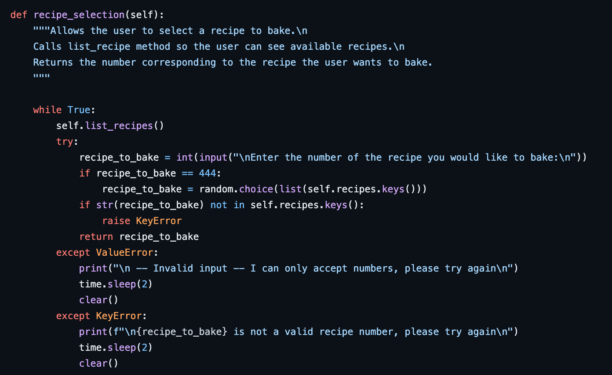

As you can see from the code above, this method uses a while loop in order to get a valid user input. Firstly, it lists the available recipes with the list_recipes() method so the user can see the available recipes (this gets updated when new recipes are added). The user is then promted to input the **number** of the recipe they would like to bake. 

As you can see from the code, there are 2 'if' statements used within this method. Firstly, if the user input == '444' (as they have selected for the 'Random Pick' option) then the value of the user input will be overidden to a random selection of the other available numbers (meaning it will pick a random recipe for them). 

The second if statement is used to ensure the user input actually corresponds to an available recipe. If the user input does not match a number of the available recipes, a KeyError is raised.

This method requires the user's input to be an integer, and as a result if the user inputs a string, a ValueError occurs, and a corresponding input error is given to the user.

Once valid input has been entered, it returns the value of 'recipe_to_bake' which is ultimately given as the value of 'choice', which can be seen on the main menu loop.

In order to 'bake' the user a treat, the following steps occur:

1. The ingredient amounts required to make the chosen recipe have to be returned
2. It needs to be checked that there are enough ingredients currently stored in the machine in order to make the recipe
3. The baked good has to be made/displayed
4. The current ingredient levels of the machine needs to be updated accordingly
5. The baked good needs to be added to the history log (which will appear under the date today/the day the baked good was made)

These steps can be observed in the following code.

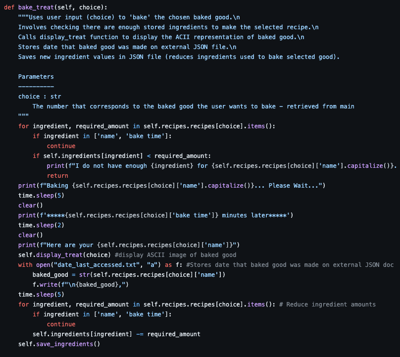

As you can see from the code above, this function accepts 'choice'. Choice refers to the user's selection of which baked treat they would like to bake (collected earlier by the recipe_selection method).

Additionally, it can be seen that 2 for loops had to be used. The first for loop is used in order to retreive the individual ingredient levels required for the chosen recipe. It can also be seen that within this loop the keys 'name' and 'bake time' were excluded from the loop as these are not ingredients and are not required in this part of the function. The second time the for loop is used is to reduce the amount of ingredients required by the recipe from the machine itself, in order to accurately represent the baked good being made. 

### 3. View Supply Levels

The third feature within the Baker3000 baking simulation, is the basic ability to view the current supply levels of the machine. Ultimately, this allows the user to guage what recipes they can and can't make and make the decision to refill ingredients if required. When the user selects this feature by inputting '2', they are presented with the following screen:

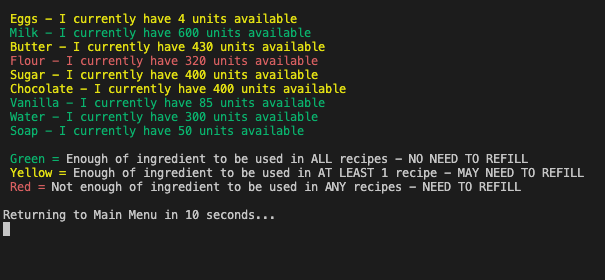

As can be seen in the image above, the ingredients the machine stores are listed and state the current level of that ingredient. In addition to this, they are colour coded depending on how much of the ingredient they have available (as a % of the maximum amount the machine can store). A key is provided that explains if the ingredient is coloured green, there is enough of that ingredient to make ANY of the stored recipes, and the user will not have to refill that ingredient before baking something. Yellow and red are also defined (as seen in picture above).

In order to colour the ingredients based on their current levels, a for loop had to be used.

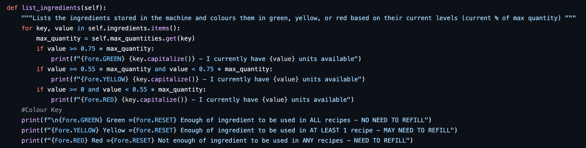

As it can be seen in the code above, a for loop was used to evaluate the current level of each ingredient against the machine's maximum capacity for that ingredient.

### 4. Refill Ingredients

The fourth feature within the Baker3000 baking simulation is the ability to refill ingredients. In order to make the simulation more realistic, up-to-date ingredient levels of the machine are stored on a JSON file. Ultimately this allows the simulation to actually represent a machine baking something.

When the user input == '3' (from the main menu) the user is presented with the following screen.

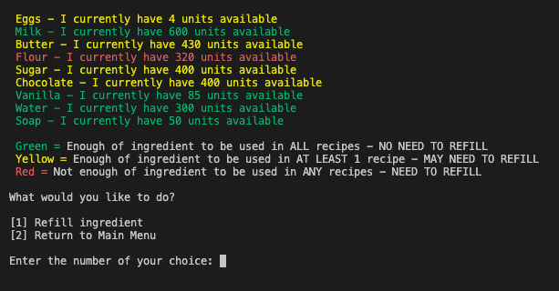

As you can see from the image above, the user is again presented with the list of ingredients and their current values (colour-coded to represent ability to make a recipe), in addition to an option to either refill ingredients or return to the main menu. This is the first user input collected if this method is called. If the user does not input a valid option (a number other than '1' or '2' or any string), this will lead to the else statement printining an invalid input message, taking the user back to the first 'decision' input at the start of the loop.

If the user selects to refill an ingredient, they are asked which ingredient they would like to refill, and if this is a valid ingredient, how much/many units they would like to add.

This is represented by the following code:

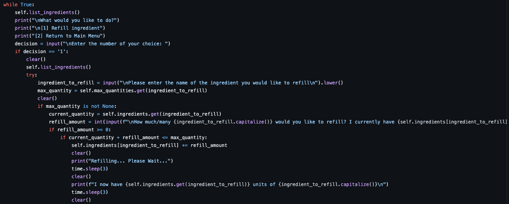
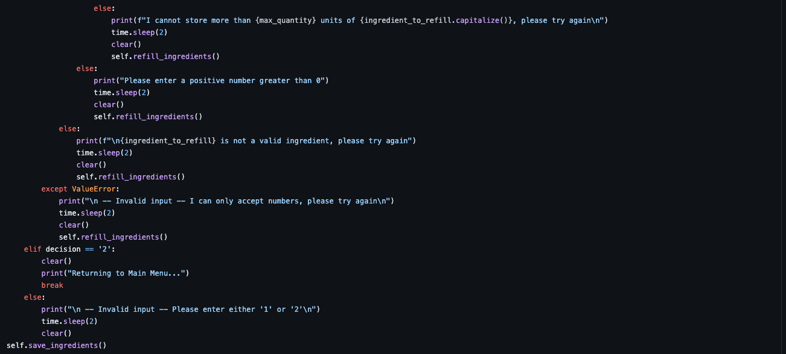

As you can see from the code above, this method uses a while loop in order to allow the user the option of refilling ingredients, or returning to main menu. By utilising a while loop here, this allows the user to potentially refill multiple ingredients before having to return to the main menu or go back to the main menu without filling any ingredients.

In order to refill an ingredient, and ensure it is valid, 3 if statements were used.

1. The first if statement ensures that the ingredient the user entered is a valid ingredient that the machine store. In addition to this, even if the user enters the ingredient in all caps, or no caps, the ingredient is accepted as the input is assigned using the .lower() function.
2. The second if statement is used to determine that the user is actually refilling the machine (entering a positive integer) and not reducing the levels of the ingredient. As a result the refill amount has to be greater than or equal to 0 in order to proceed.
3. The last if statement ensures that the user does not overfill the machine. It checks that the amount the user wants to refill + the current level of the ingredient stored in the machine, will not exceed it's maximum capacity.

If any of the if statements are not passed, a corresponding error message is returned and prompts the user to try again by re-calling the refill_ingredients method.

Once the user refills the selected ingredient, the JSON file that stores these levels is updated accordingly.

### 5. Add a Recipe

The 5th feature of the Baker3000 baking simulation, is the ability for the user to add their own recipe (that contains the machine's stored ingredients). After selecting 4 from the main menu, this is an example user terminal screen if they were to be adding a recipe for 'Doughnuts'.

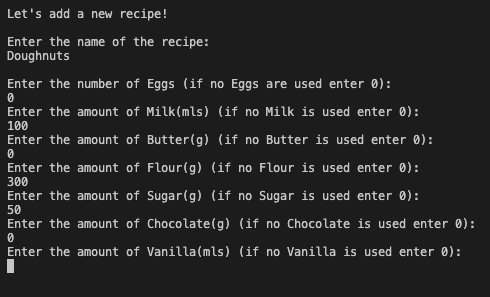

In order to add a recipe, the user needs to provide all of the information to 'Bake a Treat', which includes the recipe name, ingredient levels and the bake time. This information then needs to be loaded to the JSON file that stores the machine's recipe information.

These steps are represented by the following code:

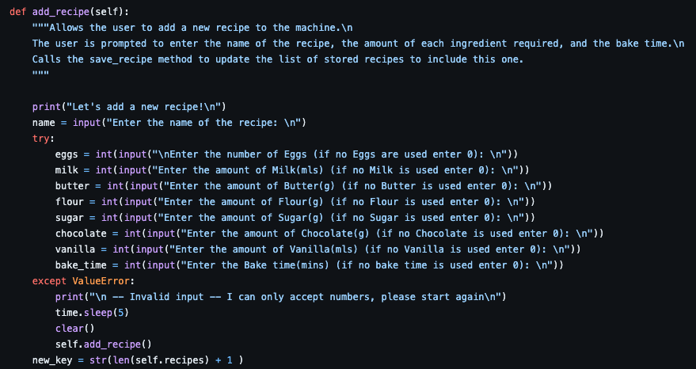
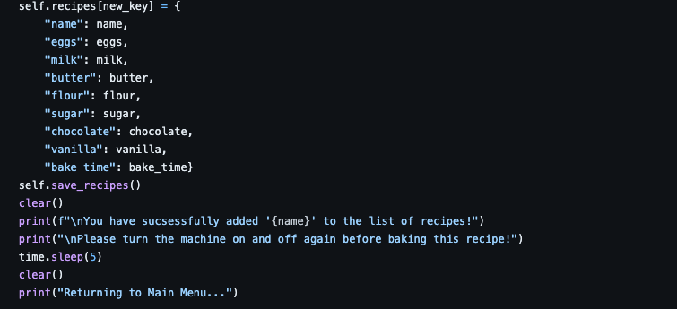

As you can see from the code above, this method requires a lot of user input. The ingredient values need to be integers in order for the other functions to work correctly. As a result, if the user trys to add a string for any of the ingredient values, a ValueError occurs and the user is prompted to start again.

It can also be seen that in order for the recipe values to be added to the stored JSON file, a new recipe key has to be created that is one more than the last recipe key. After this is created, the recipe can be added to the file and stored for future use.

### 6. Clean Machine

The 6th feature of the Baker3000 baking simulation is the ability to clean the machine. When the user input == '5', immediately runs a cleaning cycle (if there are enough ingredients). This is created using a imple if else statement.

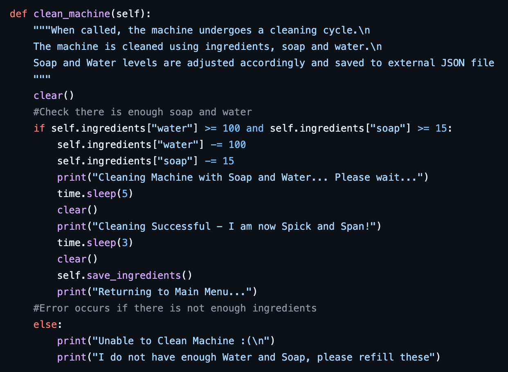

As you can see from the code above, the method checks that the machine's current levels of soap and water are equal to or more than the levels required for the cleaning cycle. If there are enough ingredients, the cleaning cycle is run and the machien's levels of soap and water are reduced accordingly in order to represent this.

If there are not enough ingredients, an error message occurs, stating that there is not enough soap and water to clean the machine and the user will have to refill these.

### 7. View Baking Log

The 7th and final feature of the Baker3000 baking simulation is the ability to View a Baking Log. When the user selects this feature they are taken straight to the log, that may look something like the following, depending on what they have baked.

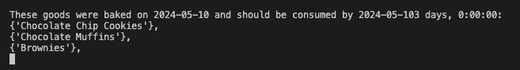

In order for this feature to work, 2 main functions/steps had to be implemented. Firstly, whenever the machine was accessed, the current date had to be recorded, and secondly, the name of each baked good made after using the 'Bake a Treat' feature had to be added under this date.

In order to do this, the following code was implemented.

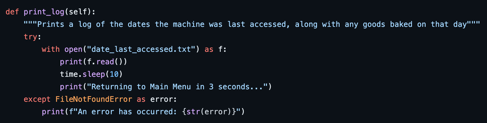

As you can see from the code above firstly there had to be an external file that held a list of the previous access dates. The first step (recording the current date whenever the machine is accessed) occurs from main interface and is called as soon as the program is run. The code that implements this is found below.

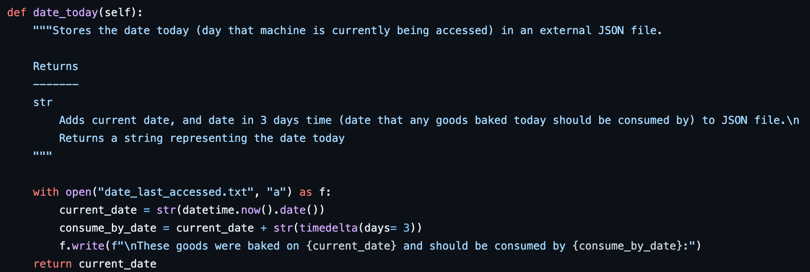

The second step (recording each baked good that is made) occurs directly after each baked good is made and can be found in the code for 'Bake a treat'.

## Implementation Plan

In order to plan and implement the steps required to build the Baker3000 simulation, Trello was used as a suitable project management platform.

The link to my Trello board for this project can be found [here](https://trello.com/invite/b/7f5AiuN5/ATTIcbc23e43b16d88b37d73700ddb9f72d5886A6240/baker-3000).

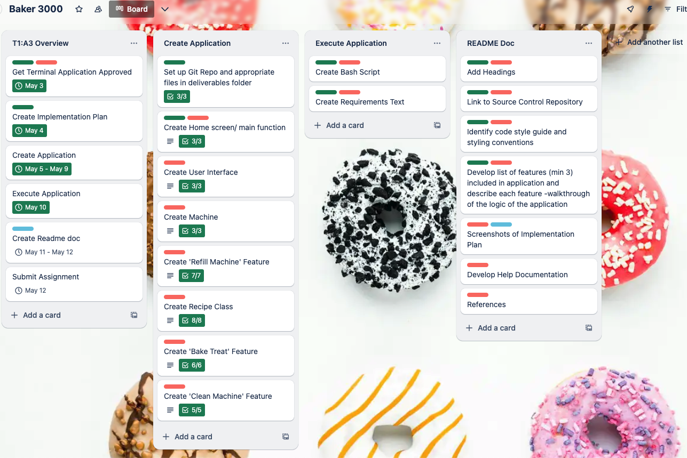

*NOTE: There are more cards in the 'Create Application' list that can't be seen.*

In order to establish the management of my project, I ordered my Trello board into 4 lists, and used labels and due dates to identify the importance/priority of each card.

The colour key for the labels can be found below.

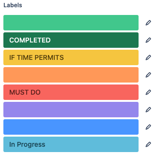

Firstly, I had an 'Assignment Overivew' list which broke the project down into the 6 broad steps that had to be taken in order to submit a complete assignment. This is where I implemented a timeline and due dates as to when each of these broad steps should be complted by. I did this as I was unsure of how long each little card (within the other lists) would take (+ found myself going back and forth between cards) so this way it gave me an overall cut-off time to have each step done by.

The next 3 lists represented one of the steps in the overivew list, which meant once each card had been ticked off on that list, the corresponding card on the overview list could be marked as completed.

The second list on the Trello Board was labelled 'Create Application' had cards that represented the classes and features that needed to be coded in order for my application to run. Each of these cards had checklists, that further explained what needed to be done in order to complete that card. Please follow the link provided to Trello above to see this in full detail but an overview is provided below.

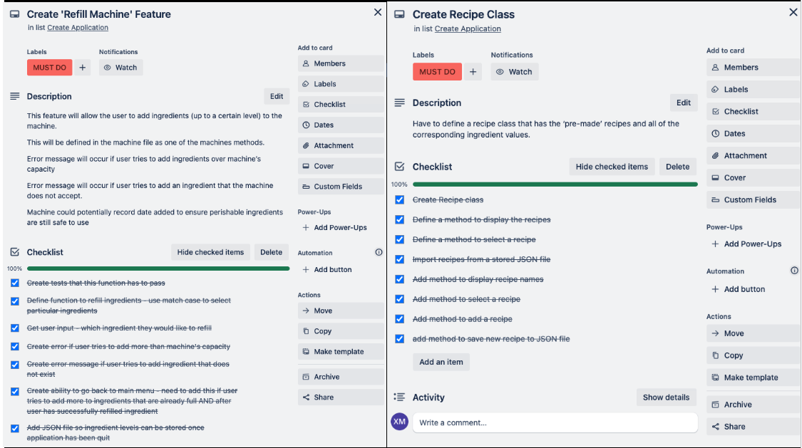
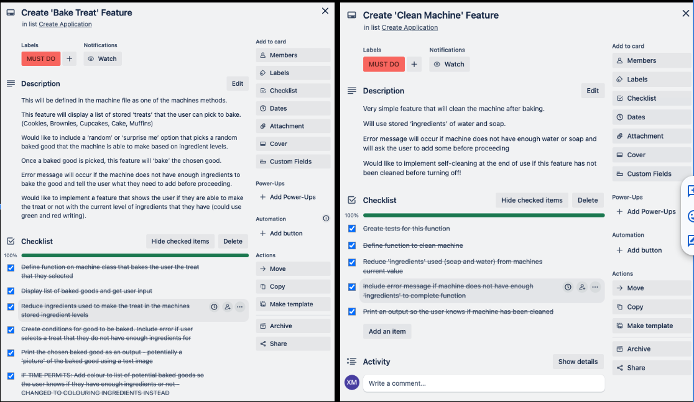
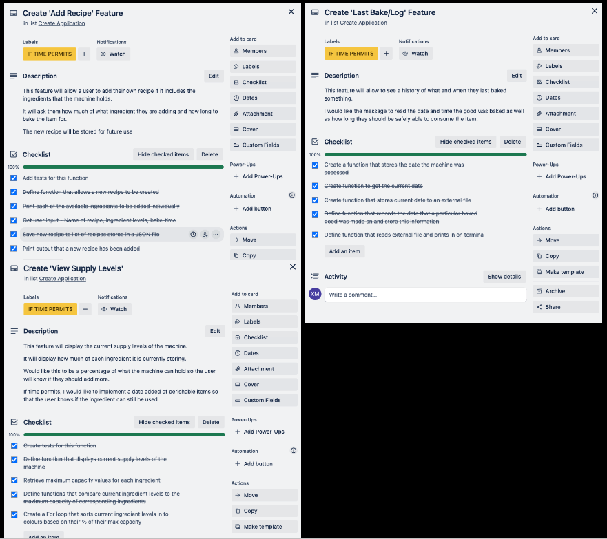

## Help Documentation

### Steps to Install Application

In order to install and run this terminal application (Baker3000), please follow the following steps:

1. Git Clone Project Code

- Follow this [link](https://github.com/xanni99/T1A3-Terminal-Application) to the GitHub repository for this application.
- Click the green < > Code Button
- From the drop down menu, copy the link generated when you click 'HTTPS'
- Open Terminal from your computer and navigate to a folder you would like to clone the application into.
- Clone the github repository by using the 'git clone' command and pasting the copied link

    ```console
    git clone https://github.com/xanni99/T1A3-Terminal-Application.git
    ```

2. Navigate into SRC folder of Cloned Directory (T1A3-Terminal-Application)

  - In order to navigate into the source code folder, paste the following:

    ```console
    cd T1A3-Terminal-Application
    ```

    ```console
    cd src
    ```

3. Run Application (+ install requirements)

    ```console
    bash run_application
    ```

### Dependencies Required

```py
colorama==0.4.6
iniconfig==2.0.0
Jinja2==3.1.4
MarkupSafe==2.1.5
packaging==24.0
pdoc==14.4.0
pluggy==1.5.0
Pygments==2.18.0
pytest==8.2.0
```

### System/ Hardware Requirements

- Operating System:
  - Windows 7-10 or 11
  - Mac OS X 10.11 or higher, 64-bit
  - Linux: RHEL 6/7, 64-bit (almost all libraries also work in Ubuntu)
- x86 64-bit CPU (Intel / AMD architecture)
- 4 GB RAM
- 5 GB free disk space

(Kinsta®, 2023)

### Software Requirements

- Python 3
  - This application requires Python 3.
  - To check if you have Python 3 installed, enter ```python --version``` into your terminal.
  - If you do not have Python 3 installed, or do not have the latest version, you can download/update [here](https://www.python.org/downloads/).

- Pip 3
  - This application requires pip 3.
  - Pip should be installed during the installation instructions.

### Command Line Arguments

When running the Baker3000 baking simulation, the terminal will prompt the user for input multiple times throughout the simulation.

There are 2 types of input that the user may have to enter:

1. Firstly, the user may have to enter a number that corresponds to a menu item. For example the user would have to input the number '1', if they would like to 'Bake a Treat'.


2.The second type of input a user may have to enter is a string. For example, when they are refilling an ingredient, they will have to type in the name of ingredient (can be caps, lowercase or a mixture).

### Features of Baker3000

The features of the Baker3000 Simulation are outlined in the following Pydoc documents.

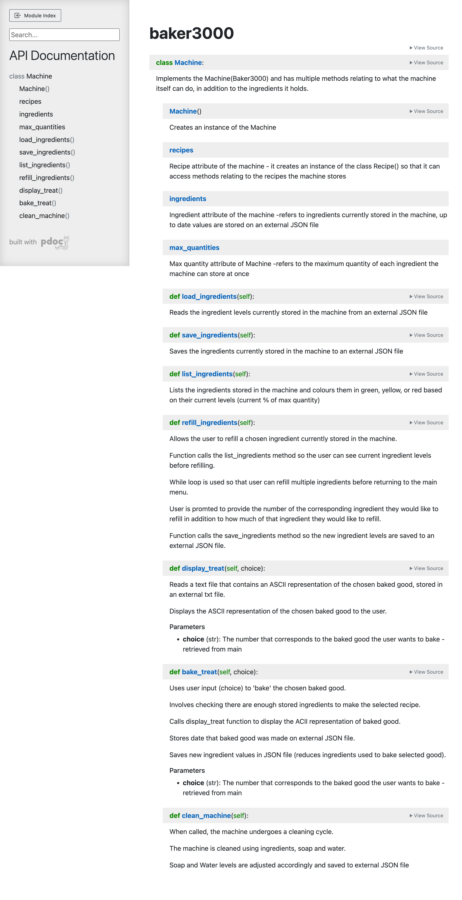
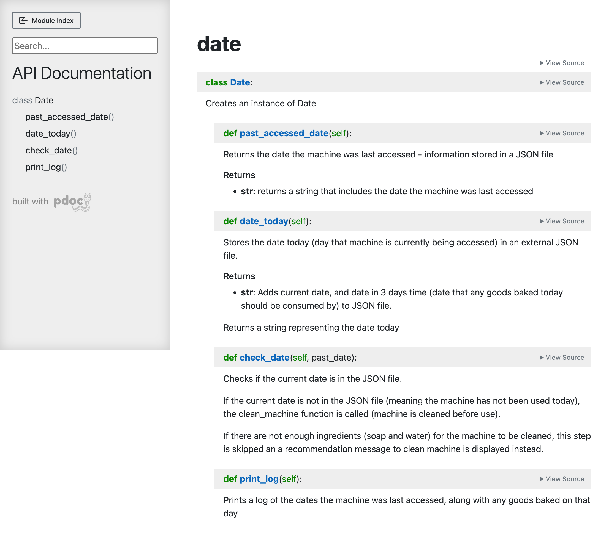
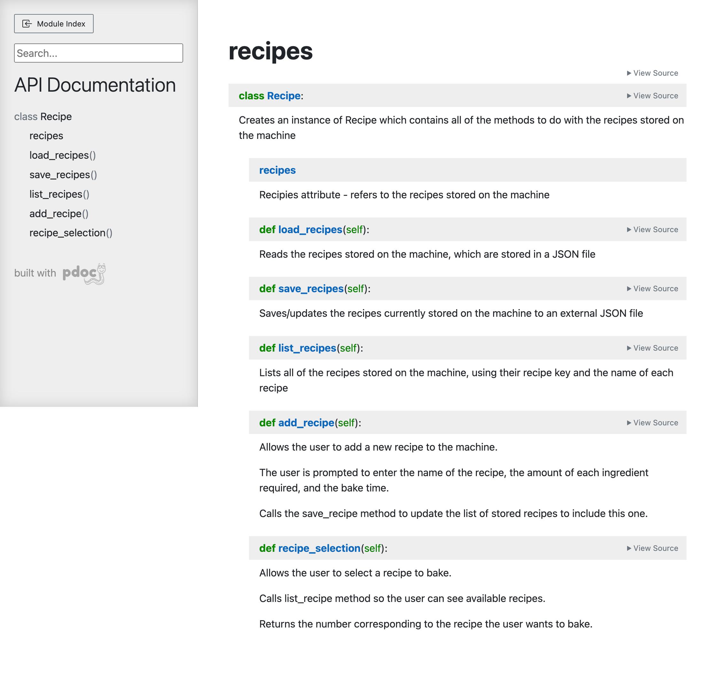
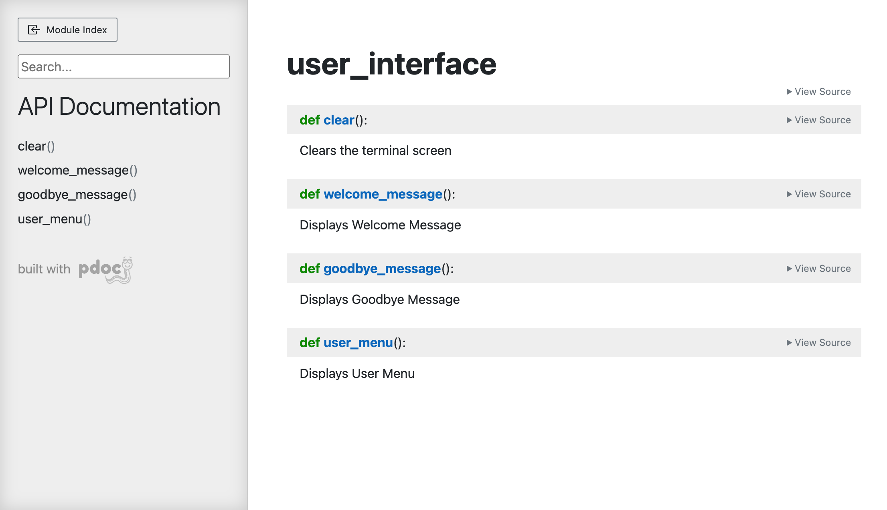

## References

Kinsta®. (2023). How To Install Python on Windows, macOS, and Linux. [online] Available at: https://kinsta.com/knowledgebase/install-python/.

van Rossum, G., Warsaw, B. and Coghlan, N. (2001). PEP 8 – Style Guide for Python Code. [online] Python.org. Available at: https://peps.python.org/pep-0008/.