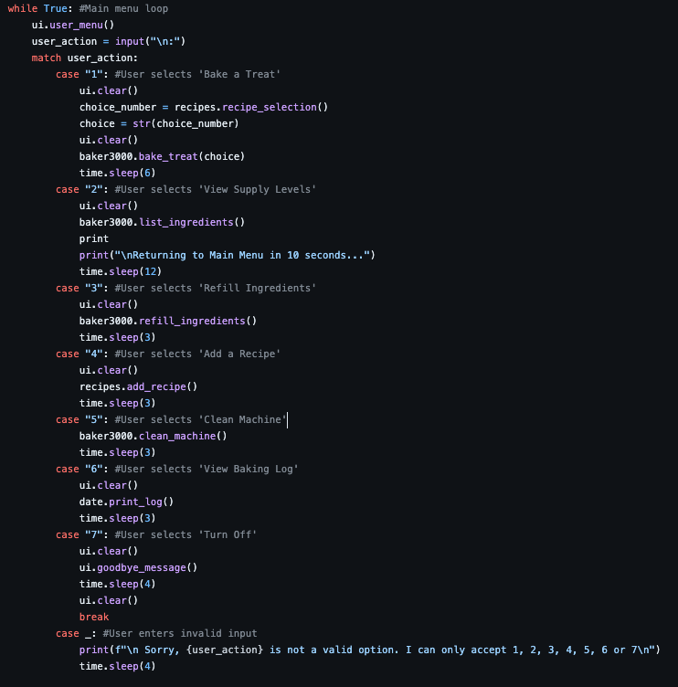

# T1A3-Terminal Application

## Github Repository

The link to the GitHub repository for this project can be found [here](https://github.com/xanni99/T1A3-Terminal-Application).

## Styling

The code for this terminal application has adhered to the conventions outlined in the PEP 8 style guide. PEP 8 was chosen as it promotes a very readable and eye-pleasing coding style.

The PEP 8 style guide can be found [here](https://peps.python.org/pep-0008/).

## Application Features

describe each feature, providing a walkthrough of the logic of the application.
Ensure that the features allow you to demonstrate your understanding of the following language elements and concepts:

- Use of variables and the concept of variable scope
- loops and conditional control structures
- error handling

My terminal application, labeled Baker3000, is a baking simulation that runs as a machine that ultimately allows the user to bake themselves a tasty lil treat. In order to do this, the simulation includes 6 features (+ the ability to exit the simulation/turn off the machine) that can be accessed from a main interface. I will describe these features in more detail below.

### 1. Main Menu

The first feature of the application is the 'Main Menu'. The main menu is what the user will use to navigate the other features of the machine. After recieving the welcome message, this is where the user lands.

As you can see from the image above, the main menu displays a message asking the user what they would like to do and to please select a number from the list of features that are available to them. 

In order to make this function like a main menu, something that the user can keep coming back to, I used a while loop with a nested match statement that uses the user's input to select the feature they would like to access. See the code below.

After taking, user input as user_action, the match statement will match the user's input with the feature they have selected. Once each feature is run, the user will return back to the main menu (in the while loop) and will be promted to give another input. This will continue until the user_input == '7', in which case the loop will be broken (through the use of a 'break' statement ) and the simulation will end. In the case that the user enters invalid input (a string or an integer not in the match statement), an error message will occur asking the user to enter a valid input.

### 2. Bake a Treat

The second feature in the Baker3000 baking simulation is the of course, the ability to bake a treat. 

### 3. View Supply Levels

### 4. Refill Ingredients

### 5. Add a Recipe

### 6. Clean Machine

### 7. View Baking Log

### 8. Turn Off

## Implementation Plan

## Help Documentation

## References

van Rossum, G., Warsaw, B. and Coghlan, N. (2001). PEP 8 – Style Guide for Python Code. [online] Python.org. Available at: https://peps.python.org/pep-0008/.